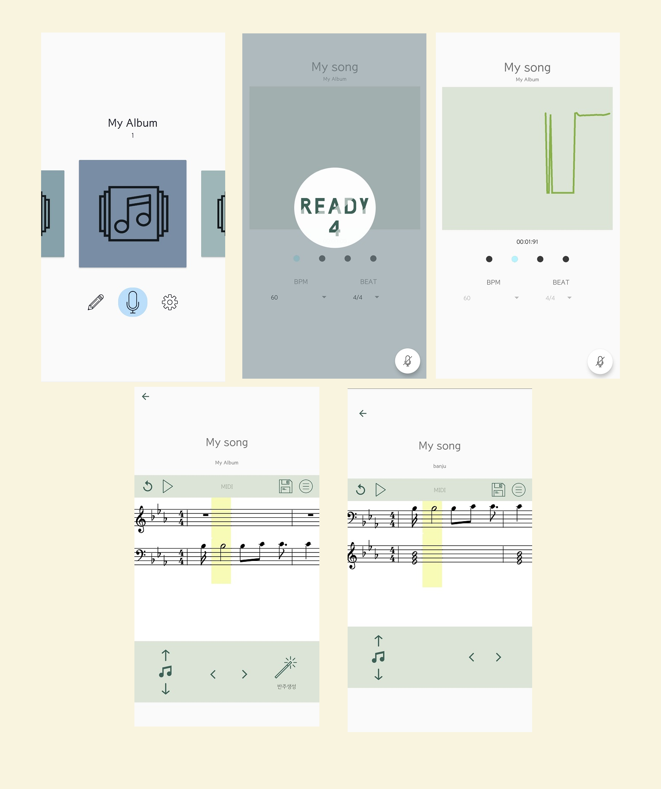

# 흥얼 (HeungR)

## 앱 소개
사용자의 음정을 실시간으로 인식하여 미디파일을 생성하고 반주를 생성하는 어플리케이션

## 주요 기능 

1) Pitch detection
   스마트폰 내부의 마이크를 이용하여 사용자가 허밍한 내용을 인식하고 FFT(Fast FourierTransform)를
   이용한 Yin 알고리즘을 을 이용하여 주파수 데이터를 추출한다. 수집한 데이터를 
   실시간으로 표현하여 사용자에게 알려주고 데이터의 음성의 높낮이를 추출하여 사용한다.
2) Midi 파일생성
   사용자의 음성에서 얻어낸 음성의 높낮이와 연속된 길이를 이용하여 미디 파일을 생성한다.
   생성된 미디 파일은 악보로 확인할 수 있으며, 피아노 연주를 통해 들을 수 있다.  
3) 앨범/곡 관리
   사용자가 어플리케이션을 이용해 작곡한 음악을 앨범과 수록곡의 형태로 관리할 수 있다. 앨범과
   수록곡은 이름 변경과 삭제가 가능하다. 또한 사용자의 아이디어를 빠르게 기록할 수 있도록 
   퀵 모드를 제공하여 편의성을 높였다.
4) 화성학 개념을 이용한 반주 생성
   화성학 개념을 이용하여 확률적으로 어울리는 반주 코드를 추론한 후 반주를 덧붙여 새로운 
   미디 파일을 생성한다. 멜로디에 어울리지 않는 음정과 코드를 구성하는 핵심음정을 기반으로
   각 마디에 적절한 반주코드를 추천하는 알고리즘을 개발하였다.
5) 파일 수정 기능
   사용자의 의도와는 다르게 녹음되었을 경우를 위해 추출된 음정의 높낮이 데이터를 추후에 
   수정할 수 있다. 또한 사용자가 원하는 스타일의 곡을 만들 수 있도록 미리 만들어진 여러
   반주를 각각 적용 후 확인할 수 있는 기능을 제공한다.
6) 파일 공유 기능
   생성된 파일의 악보를 이미지 파일로 저장하여 공유할 수 있다.

## 스크린샷

## Contributions
- [ankineri](https://github.com/ankineri)
- [MidiSheetMusic-android](https://github.com/ditek/MidiSheetMusic-Android) 
- tarsosDSP
